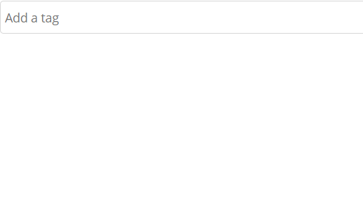
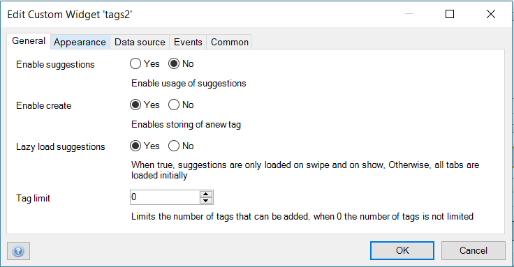
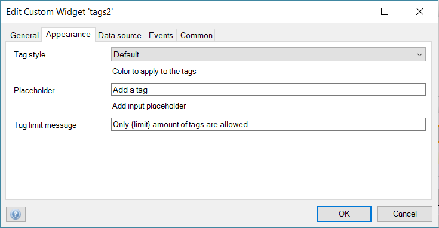

# Tag
Display and manipulate tags.

## Features
* Create new tag object when non existent
* Lazy load tag suggestions

## Dependencies
Mendix 7.7.1

## Demo project
https://tag100.mxapps.io

## Usage
Place the widget in a data view. The entity have many to many relations with a tag. Just like the core Mendix Reference set selector

Enable creation, lazyloading, suggestions and set taglimit

Add limit message, placeholder and tag style.

### Data source configuration

 - Model Configuration

 - On `Tag entity` option of the `Data source` tab, browse and 
 select the "entity" you want.
 
 
 
 - On the `Tag attribute` option of the `Data source` tab, browse and 
 select the attribute on the tag entity selected above. 

## Issues, suggestions and feature requests
We are actively maintaining this widget, please report any issues or suggestion for improvement at https://github.com/mendixlabs/tag/issues

## Development and contribution
Please follow [development guide](/development.md). 